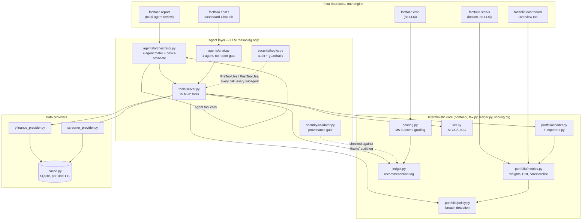
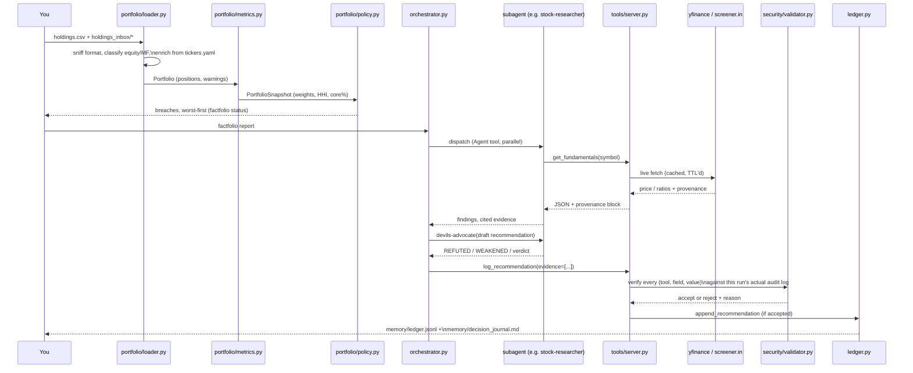
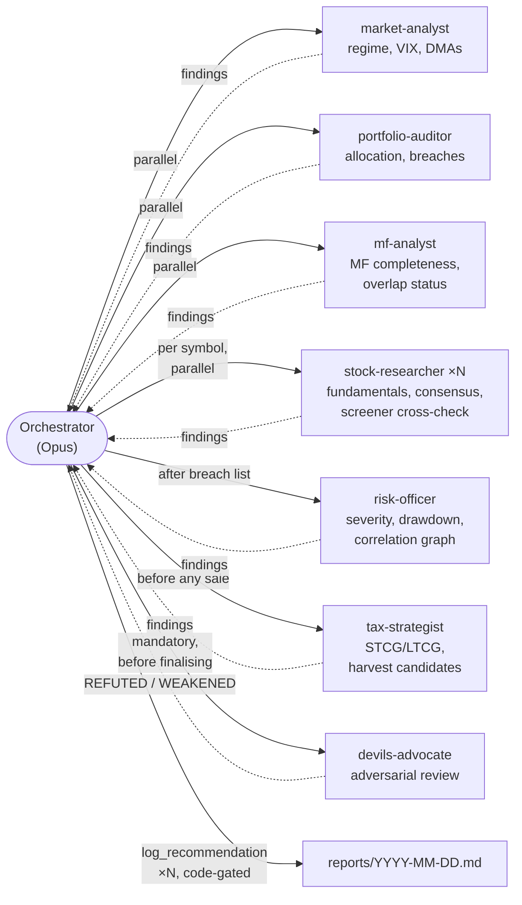
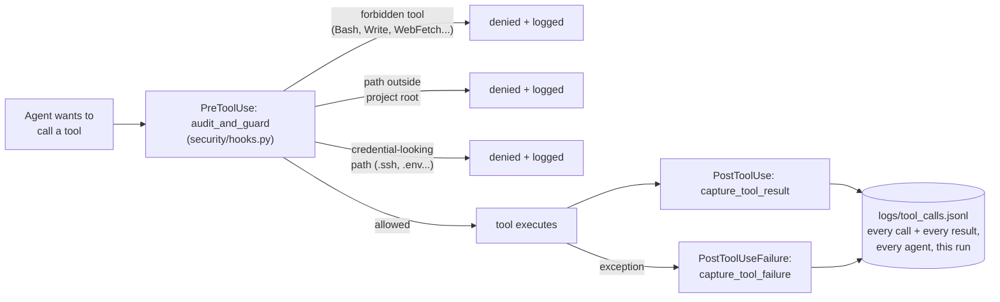
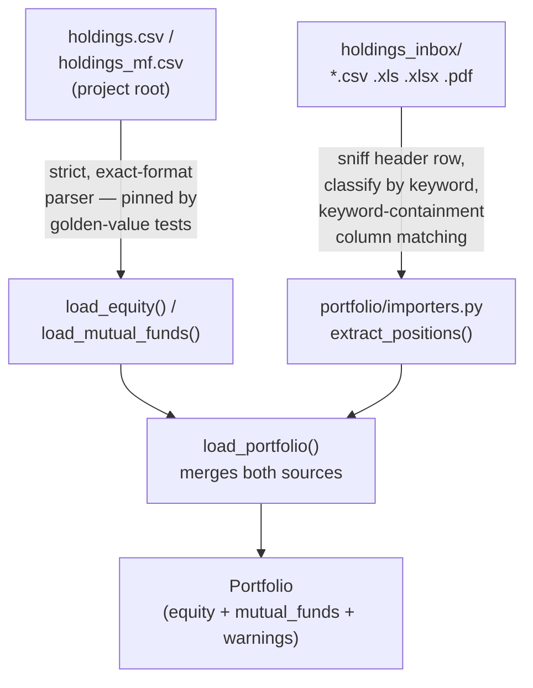

# Architecture

How FactFolio is put together, why it's structured this way, and how data
moves through it end to end. For build history and feature status, see
[`MILESTONES.md`](MILESTONES.md); for the one-line pitch, see the
[README](../README.md).

## The one design rule everything else follows

> **The LLM never computes a number.**

Every weight, return, tax figure, and correlation is computed by ordinary,
deterministic Python — the same code path every time, independent of what
any model decides to say. Agents (LLM calls) only ever do two things:
**call a tool** and **reason in prose about what the tool returned**. A
recommendation that cites a number not present in the actual tool-call log
for that run is rejected by code before it ever reaches you — not by
asking the model to double-check itself, but by a validator that reads the
audit log directly. This one rule is why the rest of the system looks the
way it does: a thin, replaceable interface layer around a deterministic
core, with the LLM only ever touching the core through named tools.

## System overview



**Read it this way:** the four ways you touch the system (CLI, report,
chat, cron) all sit on top of the *same* deterministic core — nothing about
weights, breaches, tax, or grading changes depending on which interface you
used. The agent layer is a thin reasoning shell wrapped around that core,
never a replacement for it. Data providers are the only part that talks to
the outside world, and every fetch is cached and provenance-stamped before
anything downstream sees it.

## Data flow: from holdings file to recommendation



The step that makes the whole system trustworthy is `log_recommendation` →
`verify_recommendation`: it doesn't re-ask the model "are you sure this
number is right?" — it reads the **actual PostToolUse audit log** for that
run (written by `security/hooks.py` regardless of what any agent says
happened) and checks the cited value against what the tool *really*
returned. A model can be wrong about its own reasoning; it cannot fake an
audit-log entry that was never written.

## Multi-agent orchestration (`factfolio report`)



Each subagent gets a **fresh context** — no shared memory with the
orchestrator or with each other — and its own scoped tool allowlist (a
tax-strategist call cannot call `get_market_regime`; it doesn't need to,
and the allowlist enforces that rather than trusting the prompt). The
orchestrator's own transcript *does* see every subagent's tool calls and
results directly, which is what lets `log_recommendation` accept evidence a
subagent gathered, not just evidence the orchestrator gathered itself.

`devils-advocate` is a **prompted** discipline (the orchestrator is
instructed to submit every BUY/SELL/TRIM to it and revise per its verdict)
— not code-enforced. `log_recommendation`'s evidence check *is*
code-enforced. The system prompt is explicit that only the second is
provably true regardless of what the model decides to do; the report says
so too, in "Where this analysis is weak."

## Chat: the lighter path

`factfolio chat` and the dashboard's Chat tab both run `agents/chat.py`,
deliberately **not** the orchestrator:

| | `report` (orchestrator) | `chat` |
|---|---|---|
| Agents | 7 subagents + adversarial review | 1, direct tool access |
| Model | Opus (orchestrator), mixed tiers for subagents | Sonnet throughout |
| Tools | Full roster via subagents | 12 of 15 — **no `log_recommendation`** |
| State | Single-shot `query()` per run | Multi-turn `ClaudeSDKClient` session |
| Output | Ledger-tracked, code-gated recommendation | Conversational answer only |

Chat can discuss what a good call might look like, but it cannot write one
to the ledger — the system prompt tells the user to run `factfolio report`
for that. This keeps the provenance discipline meaningful: the only path
that produces a tracked, gradeable recommendation also carries the mandatory
adversarial-review instruction.

The dashboard's Chat tab reuses the exact same `build_options()` from
`agents/chat.py`. Since Streamlit reruns the whole script on every
interaction but the SDK client wants one persistent connection across a
conversation, that tab runs a background thread with its own asyncio event
loop (held in `st.session_state`), and dispatches each turn onto it with
`run_coroutine_threadsafe`.

## Security & guardrails



Three layers, same pair of hooks, applied **session-wide including every
subagent**:

1. **Hard-forbidden tools** (`Bash`, `Write`, `Edit`, `WebFetch`, `WebSearch`,
   …) are removed from what the model can even see, via
   `disallowed_tools` — it can't attempt what isn't offered.
2. **Path confinement**: any tool argument that looks like a filesystem
   path is checked against the project root (reads) and a narrower
   writable-dirs allowlist (`memory/`, `reports/`, `logs/`, `.cache/`) for
   writes. Credential-shaped paths (`.ssh`, `.env`, `id_rsa`, …) are denied
   outright regardless of location.
3. **The audit log itself** is the foundation `verify_recommendation` reads
   from — see the data-flow diagram above.

This is also why `factfolio` never touches your actual broker account:
there is no trading tool, no execution path, nothing in the allowlist that
can place an order. The whole system is read/analyse/recommend; you decide
and execute elsewhere.

## Holdings ingestion



The root-file path is deliberately strict (it's what the pinned
golden-value tests reconcile against independently-summed CSV data); the
inbox path is deliberately permissive (real broker exports bury the data
table under account headers and disclaimers, use varying column names, and
come in whatever format the broker gives you). A file or row the inbox
importer can't confidently classify raises, naming the file — it never
silently parses to an empty or wrong result.

## Directory map

```
src/mybroker/
├── config.py              # every path, in one place — security hooks depend on this
├── portfolio/
│   ├── loader.py           # strict root-file parsing + load_portfolio() merge
│   ├── importers.py        # permissive holdings_inbox/ parsing (csv/xls/xlsx/pdf)
│   ├── metrics.py           # weights, HHI, core/satellite — all deterministic
│   ├── policy.py            # investment_policy.md → breach detection
│   ├── risk.py               # volatility, drawdown, beta
│   └── purchase_estimator.py # tentative buy-date estimation from price history
├── graphs/                # correlation.py, clusters.py (Louvain/MST), overlap.py
├── data/
│   ├── base.py              # DataResult/Provenance contract every provider implements
│   ├── yfinance_provider.py # prices, fundamentals, analyst consensus
│   ├── screener_provider.py # screener.in scrape — NPA%, shareholding, cross-check ratios
│   └── cache.py             # SQLite, per-kind TTL, honest "stale" fallback
├── tax.py                  # STCG/LTCG, per-financial-year exemption planner
├── ledger.py               # append-only recommendation log + M5 outcome write-back
├── scoring.py               # M5: grade due recommendations against real prices
├── security/
│   ├── hooks.py             # PreToolUse/PostToolUse audit + guardrails
│   └── validator.py         # log_recommendation's evidence-vs-audit-log check
├── agents/
│   ├── definitions.py        # the 7-subagent roster, tool allowlists, prompts
│   ├── orchestrator.py       # factfolio report — multi-agent, adversarial review
│   └── chat.py                # factfolio chat — single agent, no report gate
├── tools/server.py         # 15 MCP tools — the ONLY way agents touch real data
└── ui/
    ├── cli.py                # status / report / validate / dashboard / chat / cron / estimate-dates
    └── dashboard.py           # Streamlit — Overview (no LLM) + Chat tab
```

## Design principles, restated as decisions

- **Deterministic core, agentic shell.** Every number-producing function
  in `portfolio/`, `tax.py`, `graphs/` is plain Python with no model
  involved — testable, reproducible, and pinned by golden-value tests
  against real data.
- **Provenance over trust.** The system doesn't ask the model to be
  careful; it checks the model's claims against a log the model doesn't
  control.
- **Absence is data, never a zero.** A missing fundamental, an uncovered
  small-cap, a blocked overlap calculation — every one of these is surfaced
  as an explicit `null`/warning, never silently defaulted to a number that
  would be indistinguishable from a real one.
- **Conservative by default.** An unknown purchase date assumes short-term
  (higher tax). A tentative estimated date is the most-recent plausible
  match, not the oldest — the same higher-tax-by-default bias, narrowed
  with evidence instead of flipped. Every one of these defaults costs the
  user nothing to override with real data.
- **One engine, many views.** `factfolio status`, `report`, `chat`, `cron`,
  and the dashboard all compute from the same `portfolio/metrics.py` and
  `portfolio/policy.py` — there is exactly one implementation of "what does
  this portfolio look like," not one per interface.
